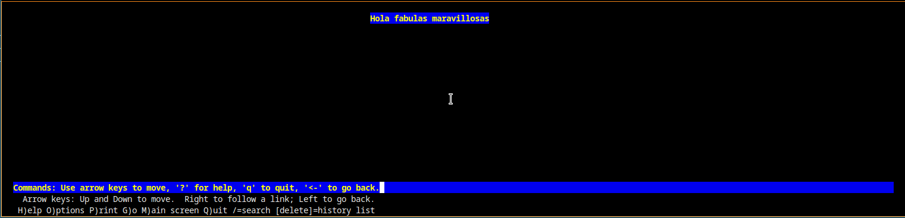
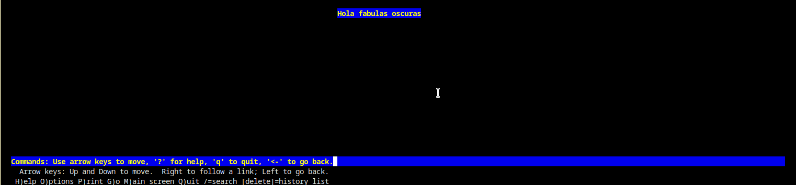

# Práctica de Instalación de Apache + Virtual host

## 1.Primer paso
El primer paso de esta práctica ese crear los ficheros de configuración necesarios para arrancar el contenedor apache. Para ello usaremos los siguientes comandos:

~~~
$ docker run --rm httpd:2.4 cat /usr/local/apache2/conf/httpd.conf > httpd.conf
~~~

~~~
$ docker run --rm httpd:2.4 cat /usr/local/apache2/conf/mime.types > mime.types
~~~

Ambos ficheros los guardaremos en el directorio *conf*
## 2.Segundo paso
Preparamos los ficheros de configuración para arrancar el servidor dns. Estos ficheros se pueden encontrar en el directorio configuracion

También crearemos el directorio zonas donde almacenamos los ficheros *db.fabulasoscuras.int* y *db.fabulasmaravillosas.int*

## 3.Tercer paso
Ahora crearemos un nuevo directorio llamado páginas y en él crearemos dos ficheros html llamados *Index.html* y *hola.html*

## 4.Cuarto paso
El siguiente paso es configurar el fichero *docker-compose.yml*. 

En él creamos un contenedor servidor apache, otro contenedor servidor dns y un contenedor cliente. Además creamos la subred a la que pertenecen estos contenedores en el propio fichero.

El fichero se encuentra subido en este mismo repositorio

## 5.Quinto paso
Añadimos los hosts virtuales en el fichero de configuración del apache *httpd.conf*

~~~
NameVirtualHost *:80

<VirtualHost *:80>
    ServerName www.fabulasoscuras.int
    DocumentRoot /usr/local/apache2/htdocs/fabulas_oscuras
</VirtualHost>

<VirtualHost *:80>
    ServerName www.fabulasmaravillosas.int
    DocumentRoot /usr/local/apache2/htdocs/fabulas_maravillosas
</VirtualHost>
~~~

## 6.Sexto paso
El último paso es comprobar en el contenedor cliente si funciona el servidor apache. Para ello instalaremos lynx con el siguente comando:

~~~
apt install lynx
~~~

Una vez instalado ejecutaremos los siguientes comandos:

~~~

lynx www.fabulasoscuras.int

lynx www.fabulasmaravillosas.int

~~~

